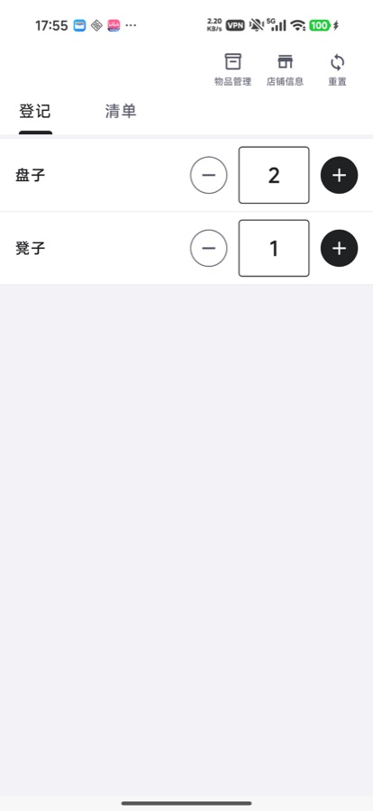
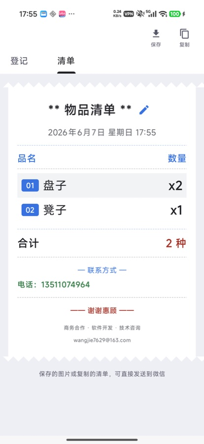
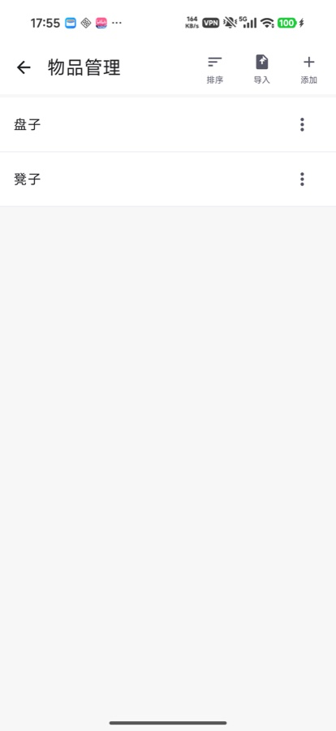
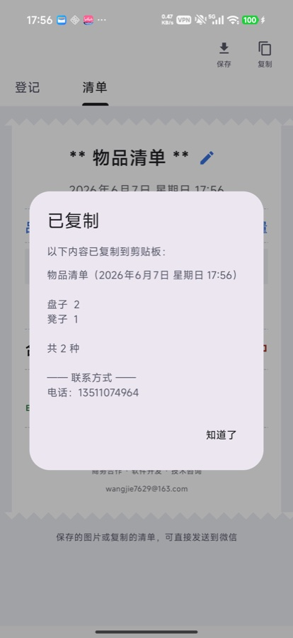
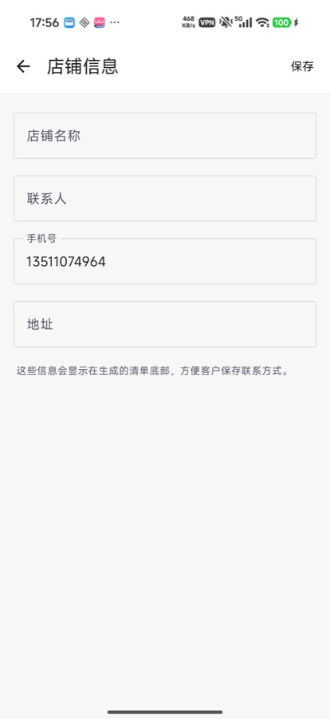
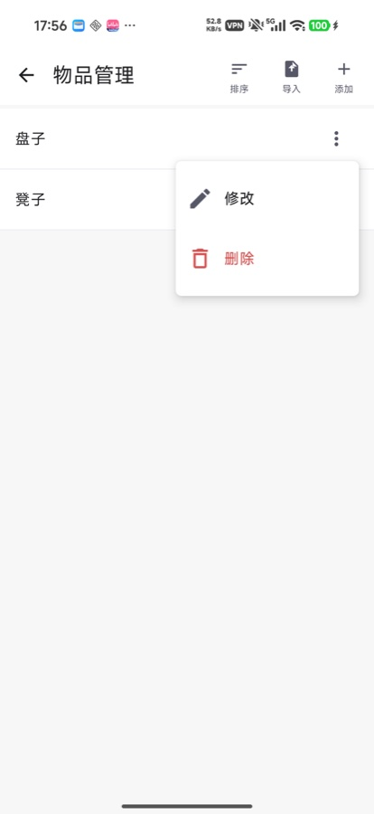
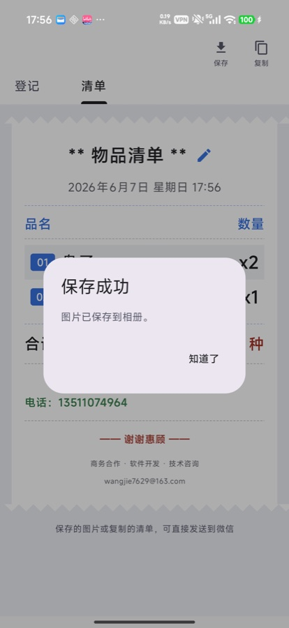

# 清单 Android

基于 Jetpack Compose 开发的本地清单管理 Android 应用，适合礼事、租赁、活动物品等场景的物品登记、数量统计和清单生成。

## 应用截图

<table>
  <tr>
    <td align="center"><br>登记页</td>
    <td align="center"><br>清单页</td>
    <td align="center"><br>物品管理</td>
  </tr>
  <tr>
    <td align="center"><br>物品操作菜单</td>
    <td align="center"><br>店铺信息</td>
    <td align="center"><br>复制清单</td>
  </tr>
  <tr>
    <td align="center"><br>保存成功</td>
  </tr>
</table>

## 功能特性

- 物品管理：添加、修改、删除、排序、批量导入
- 数量登记：增加、减少、直接输入数量、重置数量
- 清单生成：生成小票风格物品清单
- 清单操作：复制文本、保存清单图片到相册
- 店铺信息：维护店铺名称、联系人、手机号和地址
- 本地保存：使用 SharedPreferences 保存数据，不依赖服务器

## 使用方式

1. 进入 `物品管理`，点击右上角 `添加` 录入物品名称。也可以使用 `导入` 批量添加物品。
2. 在 `物品管理` 页面点击每行右侧的三点菜单，可以修改或删除物品。
3. 需要调整顺序时，点击右上角 `排序`，长按右侧拖动手柄调整物品顺序。
4. 回到 `登记` 页面，通过加号、减号或数字输入框登记每个物品的数量。
5. 切换到 `清单` 页面查看已登记物品。没有录入数量时，保存和复制按钮会置灰不可点。
6. 点击 `复制` 可以复制清单文本；点击 `保存` 可以把小票风格清单图片保存到相册。
7. 进入 `店铺信息` 维护店铺名称、联系人、手机号和地址，这些信息会显示在生成的清单底部。

## 页面说明

- `登记`：录入每个物品的数量。
- `清单`：查看已登记物品，并复制或保存为图片。
- `物品管理`：维护物品名称、顺序和批量导入。
- `店铺信息`：维护清单底部展示的联系方式。

## 技术栈

- Kotlin
- Jetpack Compose
- Material 3
- Android Gradle Plugin
- SharedPreferences + JSON

## 构建方式

使用 Android Studio 打开项目，等待 Gradle 同步完成后运行即可。

也可以在命令行构建：

```bash
./gradlew assembleDebug
```

如果本机需要指定 Android Studio 自带 JDK：

```bash
JAVA_HOME='/Applications/Android Studio.app/Contents/jbr/Contents/Home' ./gradlew assembleDebug
```

## 预览

项目 UI 使用 Jetpack Compose 编写，[MainActivity.kt](app/src/main/java/wangjie/lishimanager/MainActivity.kt) 中包含 `@Preview`，可以在 Android Studio 中查看登记页和清单页预览。

## 数据说明

应用数据保存在本机 SharedPreferences 中，主要包括：

- 物品名称、数量、排序
- 清单标题
- 店铺名称、联系人、手机号、地址

当前版本为本地单机应用，不会上传数据到服务器。
